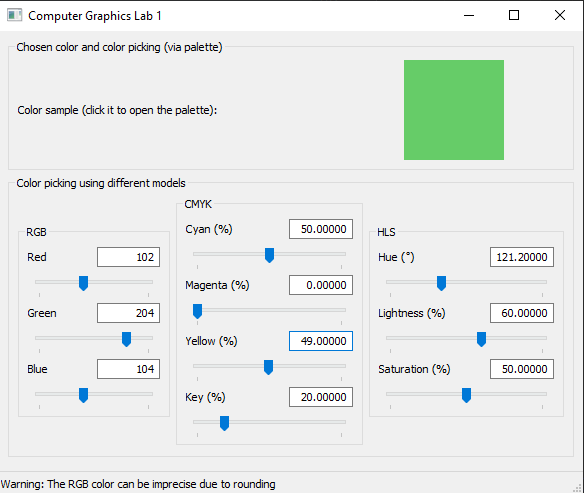

# Computer Graphics, lab 1

## Brief problem statement

Create a (web) app allowing the user to choose and interactively change the color and showing its components in three 
color models (CMYK, RGB, HLS) in real time.

## Result

## Requirements

* Go 1.15.3 or later (to build)
* Windows 7 or later

## Installation and usage

To get the source code, clone the repository or use

`go get github.com/alphaver/graphics-lab-1`

To run the app use a precompiled binary `lab1.exe` from the `bin` folder.

You may also build the project manually using `go build` from the `main` folder. The preferred form of the command is 

`go build -i -o ../bin/lab1.exe -ldflags="-H windowsgui" -tags walk_use_cgo` 

If you choose the manual build, then due to the use of the [`walk`](https://github.com/lxn/walk) package you should have
the `lab1.exe.manifest` file in the same directory where your binary is.